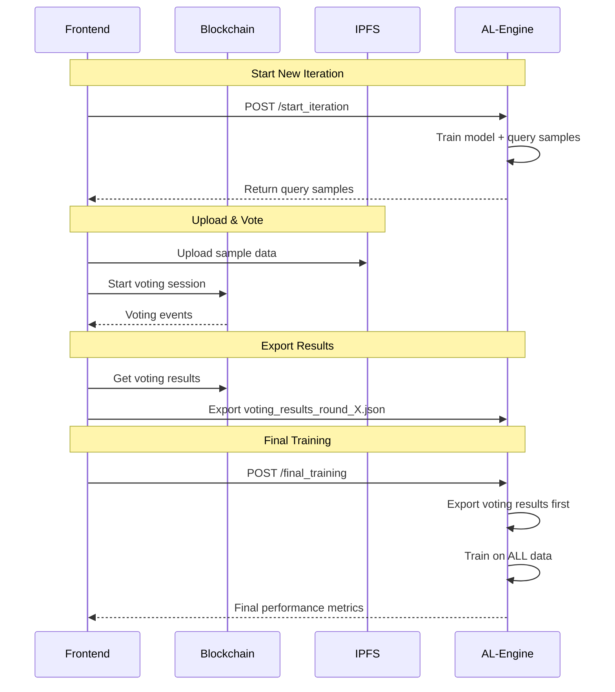

# AL-Engine: Decentralized Active Learning Engine

## Overview

The AL-Engine is a Python-based backend service that powers decentralized active learning workflows. It trains machine learning models, queries new samples for labeling, and evaluates model performance while integrating seamlessly with blockchain smart contracts and IPFS for decentralized data management.

## Architecture

```
┌─────────────────┐    ┌─────────────────┐    ┌─────────────────┐
│   Frontend      │    │   AL-Engine     │    │   Blockchain    │
│  (TypeScript)   │◄──►│   (Python)      │    │  Smart Contracts│
└─────────────────┘    └─────────────────┘    └─────────────────┘
         │                       │                       │
         │              ┌─────────────────┐              │
         └─────────────►│      IPFS       │◄─────────────┘
                        │ (Sample Storage) │
                        └─────────────────┘
```

## Core Components

### 1. AL-Engine Server (`al-engine/src/server.py`)
- **Port**: `localhost:5050`
- **Framework**: Flask REST API
- **Purpose**: Orchestrates Active Learning workflows using CWL (Common Workflow Language)

### 2. AL Iteration Script (`al-engine/src/al_iteration.py`)
- **Core Logic**: Model training, sample querying, performance evaluation
- **ML Framework**: scikit-learn with custom Active Learning implementation
- **Strategy**: Uncertainty sampling for sample selection

### 3. Data Flow Management
- **Input**: Initial labeled dataset + unlabeled pool
- **Processing**: Accumulates voting results from blockchain
- **Output**: Updated models, performance metrics, query samples

## Workflow

### 1. Project Initialization
```bash
# AL-Engine creates project structure
ro-crates/
└── {PROJECT_ADDRESS}/
    ├── inputs/
    │   ├── datasets/
    │   │   ├── labeled_samples.csv    # Initial training data
    │   │   └── unlabeled_samples.csv  # Pool for querying
    │   └── config.json               # ML configuration
    └── outputs/
        ├── models/                   # Trained model files
        ├── performance/              # Evaluation metrics
        └── query_samples/            # Samples for voting
```

### 2. Active Learning Iterations

#### Regular Iteration Flow:
```
1. Frontend → AL-Engine: POST /start_iteration
   ├── Train model on current labeled data
   ├── Query N most uncertain samples
   └── Return sample data + model performance

2. Frontend → Blockchain: Upload samples to IPFS + start voting
   ├── Store sample data on IPFS
   ├── Create voting session on blockchain
   └── Users vote on sample labels

3. Frontend → AL-Engine: Export voting results
   ├── Collect finalized labels from blockchain
   ├── Export to voting_results_round_X.json
   └── AL-Engine accumulates for next iteration
```

#### Final Training Flow:
```
1. Frontend → AL-Engine: POST /final_training
   ├── Export all remaining voting results first
   ├── Train model on ALL accumulated labeled data
   ├── Evaluate final model performance
   └── Mark training as complete
```

## API Endpoints

### Core Endpoints

#### `POST /start_iteration`
**Purpose**: Start a new AL iteration (train + query)
```json
{
  "iteration": 3,
  "project_id": "0x123..."
}
```

**Response**:
```json
{
  "success": true,
  "iteration": 3,
  "result": {
    "outputs": {
      "query_samples": "../ro-crates/0x123.../outputs/query_samples_round_3.json",
      "model_out": "../ro-crates/0x123.../outputs/model_round_3.pkl"
    }
  }
}
```

#### `POST /final_training`
**Purpose**: Perform final training on all labeled data
```json
{
  "iteration": 4,
  "project_id": "0x123...",
  "final_training": true
}
```

#### `GET /performance_history?project_id={address}`
**Purpose**: Get complete performance history
```json
{
  "performance_history": [
    {
      "iteration": 1,
      "performance": {
        "accuracy": 0.85,
        "precision": 0.83,
        "recall": 0.87,
        "f1_score": 0.85,
        "total_samples": 11,
        "training_samples": 8,
        "test_samples": 3,
        "final_training": false
      }
    }
  ]
}
```

### Utility Endpoints

- `GET /health` - Health check
- `GET /projects` - List active projects
- `GET /project/{project_id}/status` - Project status

## Data Structures

### Sample Format (Query Samples)
```json
[
  {
    "sepal length (cm)": 6.8,
    "sepal width (cm)": 3.2,
    "petal length (cm)": 5.9,
    "petal width (cm)": 2.3,
    "original_index": 17
  }
]
```

### Voting Results Format
```json
[
  {
    "original_index": 17,
    "final_label": "2"
  }
]
```

### Performance Metrics Format
```json
{
  "accuracy": 0.85,
  "precision": 0.83,
  "recall": 0.87,
  "f1_score": 0.85,
  "total_samples": 13,
  "training_samples": 10,
  "test_samples": 3,
  "label_space": ["0", "1", "2"],
  "average_strategy": "weighted",
  "final_training": false,
  "timestamp": 1754885822.602977,
  "iso_timestamp": "2025-08-11T04:17:02Z"
}
```

## Frontend Integration

### Key Frontend Services

#### 1. `DALProjectSession.ts`
- **Role**: Main orchestrator between frontend, AL-Engine, and blockchain
- **Key Methods**:
  - `startIteration()` - Triggers AL iteration workflow
  - `startFinalTraining()` - Handles final training with voting export
  - `submitBatchVote()` - Manages user voting

#### 2. `VotingResultsConnector.ts`
- **Role**: Exports blockchain voting data to AL-Engine format
- **Key Method**: `exportAllVotingResults()` - Converts blockchain votes to `voting_results_round_X.json`

#### 3. `ALEngineService.ts`
- **Role**: Direct communication with AL-Engine API
- **Key Methods**:
  - `getModelUpdates()` - Fetches performance history
  - `storeALSamplesForLabeling()` - Manages sample data for UI

### Data Flow Sequence



## Machine Learning Details

### Model Training
- **Algorithm**: Random Forest (default), Logistic Regression, SVM
- **Train/Test Split**: 80/20 with stratification
- **Performance Metrics**: Accuracy, Precision, Recall, F1-Score
- **Multiclass Support**: Automatic averaging strategy selection

### Active Learning Strategy
- **Method**: Uncertainty Sampling
- **Selection**: Samples with lowest prediction confidence
- **Batch Size**: Configurable (typically 1-5 samples per iteration)

### Sample Accumulation
```python
# Each iteration accumulates new labeled samples
if args.iteration > 1 and args.project_id:
    # Import voting results from blockchain
    newly_added = accumulate_newly_labeled_samples(
        args.project_id, 
        args.iteration, 
        args.unlabeled_data
    )
    # Update labeled dataset for training
```

## File Structure

### Project Directory Structure
```
ro-crates/{PROJECT_ADDRESS}/
├── inputs/
│   ├── datasets/
│   │   ├── labeled_samples.csv      # Growing dataset
│   │   └── unlabeled_samples.csv    # Shrinking pool
│   └── config.json                  # ML configuration
└── outputs/
    ├── query_samples_round_1.json   # Samples queried each round
    ├── query_samples_round_2.json
    ├── voting_results_round_1.json  # Finalized votes
    ├── voting_results_round_2.json
    ├── performance_round_1.json     # Model metrics
    ├── performance_round_2.json
    ├── performance_history.json     # Consolidated history
    ├── model_round_1.pkl           # Trained models
    ├── model_round_2.pkl
    └── VOTING_RESULTS_FORMAT_*.md   # Documentation
```

## Configuration

### AL-Engine Configuration (`config.json`)
```json
{
  "model_type": "RandomForestClassifier",
  "training_args": {
    "n_estimators": 100,
    "random_state": 42
  },
  "query_batch_size": 2,
  "test_split_ratio": 0.2,
  "label_space": ["0", "1", "2"]
}
```

### Frontend Configuration
```typescript
// config/index.ts
export const config = {
  alEngine: {
    apiUrl: 'http://localhost:5050'
  }
}
```

## Key Features

### 1. **Blockchain Integration**
- Voting results stored on blockchain for transparency
- IPFS for decentralized sample data storage
- Smart contract coordination

### 2. **Performance Tracking**
- Comprehensive metrics per iteration
- Historical performance comparison
- Real-time model updates

### 3. **Data Consistency**
- Automatic voting results export
- Sample uniqueness enforcement
- Original index tracking

### 4. **Error Handling**
- Graceful fallbacks for missing data
- Robust file I/O operations
- Network failure recovery

## Common Issues & Solutions

### Issue: Missing Voting Results
**Problem**: Final training uses fewer samples than expected
**Solution**: Ensure `VotingResultsConnector.exportAllVotingResults()` runs before final training

### Issue: Sample ID Conflicts
**Problem**: Duplicate samples across iterations
**Solution**: Use `round_{iteration}_sample_{original_index}` format

### Issue: Train/Test Split Problems
**Problem**: Insufficient samples for proper evaluation
**Solution**: Dynamic split ratios based on dataset size

## Development & Debugging

### Useful Log Patterns
```bash
# AL-Engine activity
grep "Starting AL iteration" al-engine.log

# Performance tracking
grep "Total Samples:" al-engine.log

# Voting results export
grep "Exported voting results" frontend.log

# Final training
grep "Final training:" al-engine.log
```

### File Locations
- **Logs**: Check browser console + AL-Engine terminal
- **Models**: `ro-crates/{project}/outputs/model_round_X.pkl`
- **Performance**: `ro-crates/{project}/outputs/performance_history.json`
- **Samples**: `ro-crates/{project}/outputs/query_samples_round_X.json`

---

## Quick Start

1. **Start AL-Engine**: `cd al-engine && python src/server.py`
2. **Connect Frontend**: Ensure `localhost:5050` connectivity
3. **Create Project**: Deploy via frontend
4. **Run Iterations**: Use "Start Next Iteration" button
5. **Final Training**: Click "Start Final Training" when ready

The AL-Engine handles all machine learning complexity while the frontend manages user interaction and blockchain coordination. 