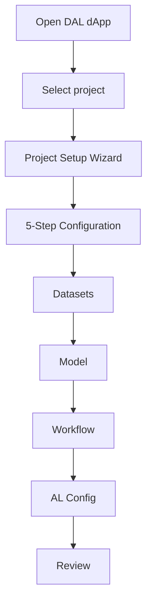
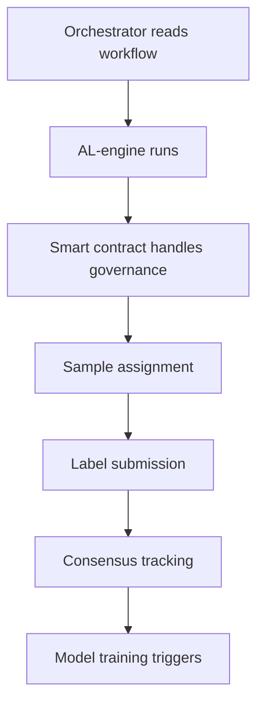

# Refined DAL Architecture: RO-Crate + Smart Contract

## 🧭 **Overview**

The DAL (Decentralized Active Learning) extension has been completely redesigned following research best practices that separate **reproducibility** from **governance**. This architecture implements your recommended approach using:

- **RO-Crate** → For reproducible research metadata, FAIR data principles, and execution artifacts
- **Smart Contract** → For governance, coordination, collaboration, and auditability
- **5-Step Project Lifecycle** → From creation to completion with proper validation at each stage

---

## 🏗️ **Architecture Components**

### **1. RO-Crate (Research Object Crate)**
- **Purpose**: Reproducible research metadata container following FAIR principles
- **Standards**: JSON-LD, schema.org, Research Object Crate 1.1
- **Contains**: Datasets, workflows, models, configurations, outputs, provenance

### **2. Smart Contract Integration**
- **Purpose**: Project governance, participant management, lifecycle control
- **Provides**: Access control, voting, consensus, audit trail, incentives
- **Manages**: Project status, contributor roles, permissions, coordination

### **3. Project Setup Wizard**
- **Purpose**: Guided 5-step project configuration following research standards
- **Validates**: Each step before proceeding to ensure project integrity
- **Generates**: Complete RO-Crate with proper metadata and links to smart contract

---

## 🔄 **5-Step Project Lifecycle**

### **Step 1: Project Creation (via Collaboration Tab)**
```mermaid
graph LR
    A[User clicks "New Project"] --> B[Provide project details]
    B --> C[System creates empty RO-Crate]
    C --> D[Deploy project smart contract]
    D --> E[Project appears in hub]
```

**What happens:**
- User provides project name, description, type ("DAL")
- System creates empty RO-Crate with project metadata stub
- Deploys project smart contract with initial state
- Project appears in DVRE hub with "draft" status

**Artifacts created:**
- `ProjectContract` with coordinator address and initial governance rules
- `RO-Crate` with project metadata shell and smart contract reference

### **Step 2: Project Setup (inside DAL dApp)**


**User configures:**
- **Datasets**: Upload/link training and labeling datasets with metadata
- **Model**: Select algorithm (neural network, logistic regression, etc.) and parameters
- **Workflow**: Generate CWL workflow or provide custom workflow definition
- **AL Configuration**: Query strategy, labeling budget, federated learning settings
- **Review**: Validate configuration and export RO-Crate metadata

### **Step 3: Project Finalization**
```mermaid
graph LR
    A[User confirms config] --> B[Update RO-Crate]
    B --> C[Validate metadata]
    C --> D[Store on IPFS/storage]
    D --> E[Update smart contract]
    E --> F[Status: "ready"]
```

**System actions:**
- Updates RO-Crate with finalized datasets, workflow, and configurations
- Validates RO-Crate structure and metadata completeness
- Stores RO-Crate metadata (optionally on IPFS for decentralization)
- Updates smart contract with RO-Crate URI/hash and status = "ready"
- Contributors can now join and participate

### **Step 4: During Execution**


**Active Learning execution:**
- Orchestrator reads CWL workflow from RO-Crate
- AL-engine executes on coordinator's infrastructure
- Smart contract manages:
  - Contributor voting and consensus on sample labels
  - Session status (active/paused/stopped)
  - Access control and permissions
  - Progress tracking and metrics

### **Step 5: Completion & Archiving**
```mermaid
graph LR
    A[Coordinator ends project] --> B[Publish results]
    B --> C[Update RO-Crate outputs]
    C --> D[Archive to IPFS]
    D --> E[Update smart contract]
    E --> F[Status: "completed"]
```

**Finalization process:**
- Publishes final results (labeled dataset, trained model, metrics)
- Updates RO-Crate with output metadata and performance metrics
- Archives complete RO-Crate to permanent storage (IPFS)
- Updates smart contract status to "completed" with final hashes
- Project becomes immutable research artifact

---

## 📁 **RO-Crate Structure**

```json
{
  "@context": "https://w3id.org/ro/crate/1.1/context",
  "@graph": [
    {
      "@type": "CreativeWork",
      "@id": "ro-crate-metadata.json",
      "conformsTo": {"@id": "https://w3id.org/ro/crate/1.1"}
    },
    {
      "@type": "Dataset",
      "@id": "./",
      "name": "DAL Project: Medical Image Classification",
      "description": "Collaborative Active Learning for medical imaging",
      "creator": "0x742d35Cc6Ff678d1b2Bfa32...",
      "license": "CC-BY-4.0",
      "hasPart": [
        {"@id": "project-12345"},
        {"@id": "training-dataset-67890"},
        {"@id": "workflow-13579.cwl"},
        {"@id": "model-24680"}
      ]
    },
    {
      "@type": "Project",
      "@id": "project-12345",
      "name": "Medical Image Classification AL",
      "projectType": "DAL",
      "status": "ready",
      "coordinator": "0x742d35Cc6Ff678d1b2Bfa32...",
      "contributors": ["0x123...", "0x456..."],
      "smartContractAddress": "0x789abc...",
      "blockchainNetwork": "ethereum"
    },
    {
      "@type": "Dataset",
      "@id": "training-dataset-67890",
      "name": "Medical Images Training Set",
      "encodingFormat": "text/csv",
      "url": "https://ipfs.io/ipfs/Qm...",
      "columns": [
        {"name": "image_path", "dataType": "string"},
        {"name": "diagnosis", "dataType": "string"},
        {"name": "confidence", "dataType": "number"}
      ]
    },
    {
      "@type": ["File", "SoftwareSourceCode", "ComputationalWorkflow"],
      "@id": "workflow-13579.cwl",
      "name": "DAL Medical Imaging Workflow",
      "programmingLanguage": "cwl",
      "input": ["dataset", "query_strategy", "labeling_budget"],
      "output": ["labeled_data", "trained_model", "metrics"]
    },
    {
      "@type": ["File", "SoftwareSourceCode"],
      "@id": "model-24680",
      "name": "Neural Network Classifier",
      "algorithm": "neural_network",
      "parameters": {
        "layers": [64, 32],
        "learning_rate": 0.001,
        "batch_size": 32
      }
    }
  ]
}
```

---

## 🔧 **Technical Implementation**

### **ROCrateManager Class**
```typescript
class ROCrateManager {
  createDALROCrate(projectId, name, description, coordinator, alConfig): DALROCrate
  addTrainingDataset(roCrate, datasetInfo): DALROCrate
  addWorkflow(roCrate, workflowInfo): DALROCrate
  addModel(roCrate, modelInfo): DALROCrate
  updateProjectStatus(roCrate, status): DALROCrate
  validateROCrate(roCrate): ValidationResult
  exportMetadata(roCrate): string
  saveROCrate(projectId, roCrate): void
  loadROCrate(projectId): DALROCrate | null
}
```

### **ProjectSetupWizard Component**
```typescript
interface ProjectSetupWizardProps {
  projectId: string;
  projectData: any; // DVRE project data from smart contract
  userWallet: string;
  onComplete: (roCrate: DALROCrate) => void;
}
```

**Features:**
- ✅ 5-step guided configuration process
- ✅ Real-time validation at each step
- ✅ RO-Crate generation and management
- ✅ Integration with smart contract data
- ✅ FAIR metadata compliance
- ✅ Export capabilities for research reproducibility

### **Enhanced Integration**
- **DVRE Project Data**: Reads participant info, roles, and governance from smart contracts
- **MetaMask Authentication**: Wallet-based user identification and signing
- **Multi-user Session Management**: Contributors, coordinators, and observers with proper permissions
- **Orchestration Server**: Enhanced with RO-Crate workflow reading and execution

---

## 🚀 **Key Benefits**

### **✅ Research Standards Compliance**
- **FAIR Principles**: Findable, Accessible, Interoperable, Reusable
- **RO-Crate Standard**: JSON-LD metadata following schema.org
- **Reproducibility**: Complete workflow and data provenance tracking
- **Citability**: Permanent identifiers and structured metadata

### **✅ Decentralized Governance**
- **Smart Contract Control**: Transparent, auditable project governance
- **Role-Based Access**: Coordinators, contributors, observers with proper permissions
- **Consensus Mechanisms**: Decentralized label validation and agreement
- **Incentive Alignment**: Token-based rewards for quality contributions

### **✅ Scalable Architecture**
- **Modular Design**: Clear separation between data, workflows, and governance
- **Standard Interfaces**: CWL workflows, JSON-LD metadata, Ethereum contracts
- **Interoperability**: Works with existing research infrastructure
- **Future-Proof**: Extensible for different ML paradigms and research domains

---

## 📊 **User Journey Examples**

### **Medical Researcher (Coordinator)**
1. **Create Project**: "Collaborative Skin Cancer Classification"
2. **Setup Datasets**: Upload dermoscopy images with partial labels
3. **Configure Model**: Neural network with transfer learning from ImageNet
4. **Design Workflow**: Uncertainty sampling + expert validation pipeline
5. **Invite Contributors**: Medical experts and citizen scientists
6. **Execute**: Monitor labeling progress and model improvement
7. **Publish**: Archive complete RO-Crate to medical research repository

### **Machine Learning Expert (Contributor)**
1. **Receive Invitation**: Email/wallet notification with project details
2. **Review Project**: Examine RO-Crate metadata and research objectives
3. **Accept Role**: Connect wallet and join as contributor
4. **Label Samples**: Annotate assigned medical images with confidence scores
5. **Track Consensus**: Monitor agreement with other experts
6. **Receive Rewards**: Token incentives for quality contributions

### **Research Infrastructure Provider**
1. **Deploy Orchestrator**: Set up CWL execution environment
2. **Read RO-Crate**: Automatically parse project metadata and workflows
3. **Execute Workflows**: Run Active Learning iterations with proper provenance
4. **Archive Results**: Store outputs with complete lineage information
5. **Provide APIs**: Enable integration with institutional repositories

---

## 🎯 **Future Enhancements**

### **Phase 2: Advanced Features**
- [ ] **IPFS Integration**: Decentralized storage for large datasets and models
- [ ] **Cross-Chain Support**: Multi-blockchain deployment for different research communities
- [ ] **Advanced Consensus**: Weighted voting based on contributor expertise scores
- [ ] **Automated Quality Control**: ML-based detection of low-quality contributions

### **Phase 3: Research Ecosystem**
- [ ] **Repository Integration**: Direct publishing to Zenodo, DataCite, etc.
- [ ] **Citation Networks**: Automatic DOI assignment and citation tracking
- [ ] **Cross-Project Discovery**: Semantic search across federated AL projects
- [ ] **Benchmark Datasets**: Standardized evaluation sets for AL algorithm comparison

---

## 🏆 **Success Metrics**

### **Research Impact**
- **Reproducibility**: 100% of projects with complete RO-Crate metadata
- **Reusability**: Workflows executable on any CWL-compatible infrastructure
- **Citability**: Automatic DOI assignment and citation tracking
- **Discoverability**: Integration with research data catalogs

### **Community Adoption**
- **Active Projects**: Target 100+ collaborative AL projects in first year
- **Contributor Network**: Build network of 1000+ verified researchers
- **Quality Metrics**: Average contributor accuracy >90% on validation sets
- **Research Publications**: Enable 50+ peer-reviewed papers using the platform

---

This refined architecture transforms DAL from a simple workflow tool into a **comprehensive research infrastructure** that properly separates concerns between reproducible research artifacts (RO-Crate) and decentralized governance (Smart Contracts), following established research standards while enabling true collaborative science. 